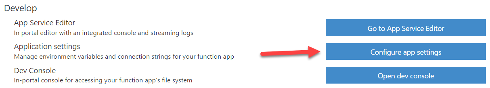
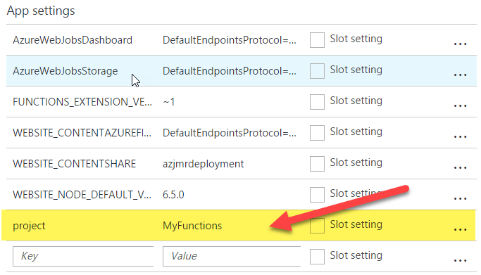

# Azure Functions Custom Deployment

This repo is used as an example for deploying [Azure Functions](https://azure.microsoft.com/en-us/services/functions/) from a specific folder within a repo. 

To configure this functionality, simply add go to app settings and add a new key called 'project' and point it to the folder you want to pull your Azure Functions from.

Highlighted below are the app settings:

For more advanced options visit [https://github.com/projectkudu/kudu/wiki/Customizing-deployments](https://github.com/projectkudu/kudu/wiki/Customizing-deployments)

Contact me [@joescars](https://twitter.com/joescars) with any questions.

